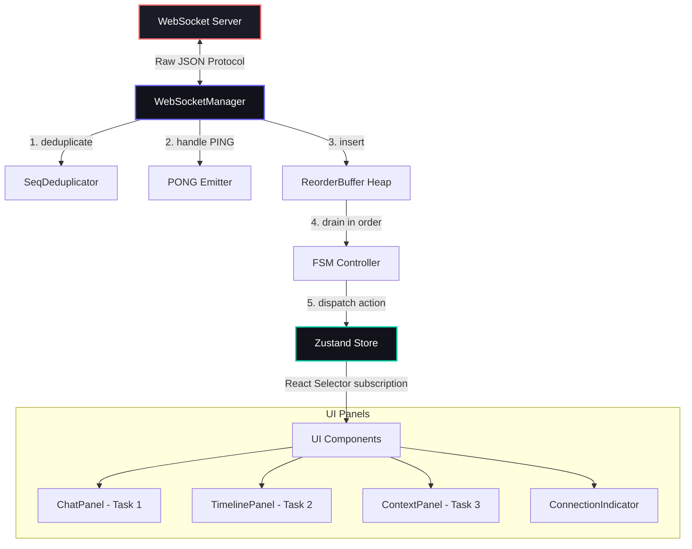
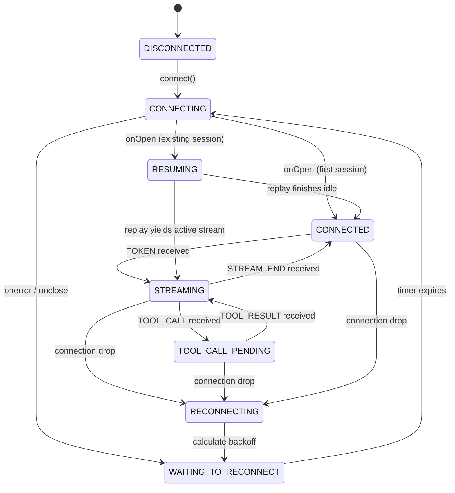
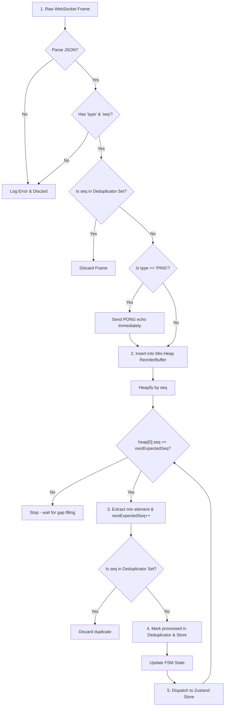
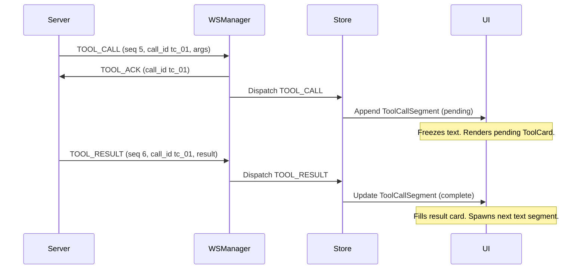
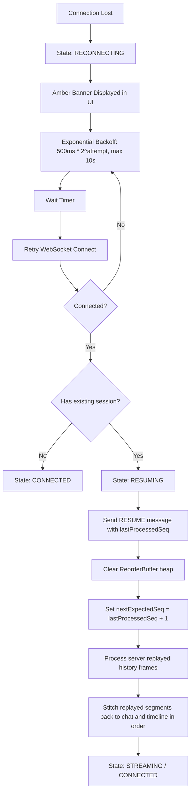

# Agent Console — Technical Specification & Guide

A high-fidelity, real-time AI Agent Console built with Next.js 16 (App Router), Zustand, and TypeScript. It implements a resilient WebSocket manager that survives drops, latency spikes, and duplicates in chaos mode while maintaining pixel-perfect sync between the chat thread, event traces, and context visualizations.

---

## 1. Architectural Design

The console divides responsibility between raw WebSocket/protocol logic and the reactive UI render loop.



### Key Components:
- **WebSocketManager** (`lib/websocket-manager.ts`): Houses connection setup, keepalive timers, send buffers, and raw frame receivers. Direct logic only—completely detached from the React render loop.
- **ReorderBuffer** (`lib/reorder-buffer.ts`): Stores out-of-order frames in a Min-Heap.
- **SeqDeduplicator** (`lib/dedup.ts`): Discards duplicate frames using a stateful sequence-number set.
- **Zustand Store** (`lib/store.ts`): Manages application state. Surgical subscriptions ensure only modified slices trigger re-renders.

---

## 2. WebSocket Connection State Machine

The socket connection transitions through the following FSM states:



---

## 3. Sequence-Based Message Pipeline

When the client receives a message via the WebSocket, it passes through a 5-step pipeline:



---

## 4. Message Type Protocols

### 1. `TOKEN` Flow (Streaming response segment)
1. **WS Reception**: A token message arrives with sequence number $S$ and text chunk.
2. **Buffer Processing**: Placed in heap; once drained in-order, state updates to `STREAMING`.
3. **Store Dispatch**: 
   - Locates or initializes the active `AgentMessage` matching `stream_id`.
   - Appends text to the last `text` segment. If the previous segment was a tool call, it spawns a fresh `text` segment (ensuring sequential segment stacking).
   - Groups consecutive tokens into a timeline `TokenBatch` row if timestamps are within 300ms.
4. **DOM Render**: Appends directly to text elements via React ref nodes to prevent overall panel reflowing.

### 2. `TOOL_CALL` and `TOOL_RESULT` Flow (Mid-stream pauses)


### 3. `CONTEXT_SNAPSHOT` Flow (Working memory tracking)
1. Context payload arrives containing syntax trees.
2. Store registers the data in `contextSnapshots` mapped by `context_id`.
3. The scrubber slider is updated, computing a deep JSON diff comparing the new context to the previous snapshot:
   - Green highlights for added keys.
   - Red highlights for deleted keys (drawn with a strikethrough).
   - Yellow highlights for modified values.

### 4. `PING` & `PONG` Flow (Heartbeat keepalive)
1. **Fast PONG**: Upon receiving a `PING` frame, a `PONG` response is dispatched **instantly** to avoid timeout triggers on the server.
2. **Empty Challenge Handling**: If `msg.challenge` is empty or missing, a `PONG` is returned with an empty echo `""` to satisfy corrupt ping survival metrics without crashing.
3. **Trace Entry**: The PING is added to the reorder buffer. When drained, it registers as a row in the trace timeline.

### 5. `ERROR` Flow (Server-side anomalies)
1. Server reports an anomaly.
2. WSManager transitions connection state to `CONNECTED` (idle) to release input locks, and logs it.
3. A red-colored log row is pushed to the trace timeline.

### 6. `STREAM_END` Flow (Turn completion)
1. End packet arrives.
2. Connection FSM transitions to `CONNECTED`.
3. Active `AgentMessage` is marked `isComplete = true` and the blinking text cursor is hidden.

---

## 5. State Recovery Protocol (RESUME)

The following flow illustrates how the console reconstructs history when recovering from a network drop:



---

## 6. Setup & Execution Instructions

### Installation
```bash
npm install
```

### Development Run
Runs the client at [http://localhost:3000](http://localhost:3000):
```bash
npm run dev
```

### Production Build & Run
```bash
npm run build
npm start
```
